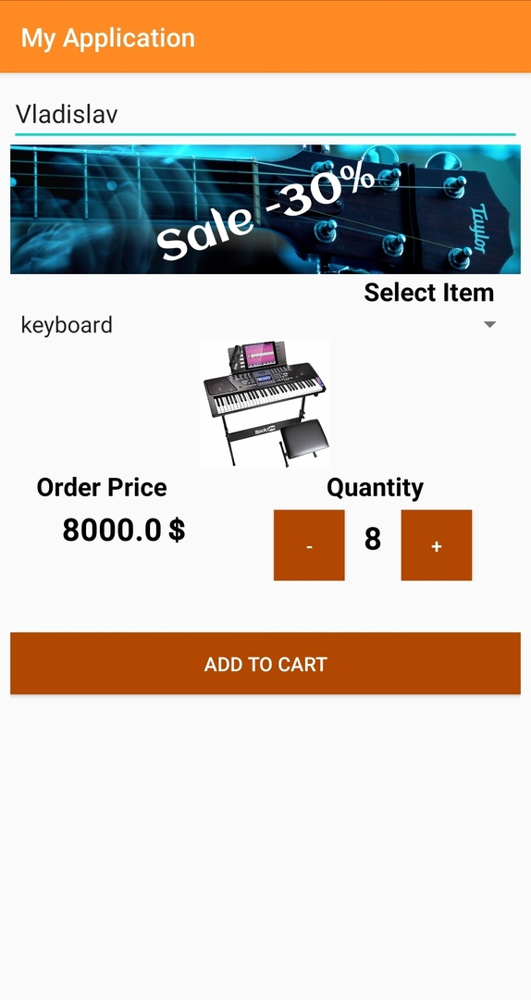

# android-java-music-shop
First android music shop app on java with classes, layouts, views, activities

# What can it  do?
  - Select music instrument by spinner element
  - Quantity selection
  - Shows price and order price

# What I learnt?
  - Java basics
  - Java classes(polymorphism, inheritance, constructors, overriding, static and final, interior, static interior classes, local classes, anonymous and abstract classes)
  - Send data to another activity by putExtra method

# Screen 1

# Screen 2

**hello world:)**
